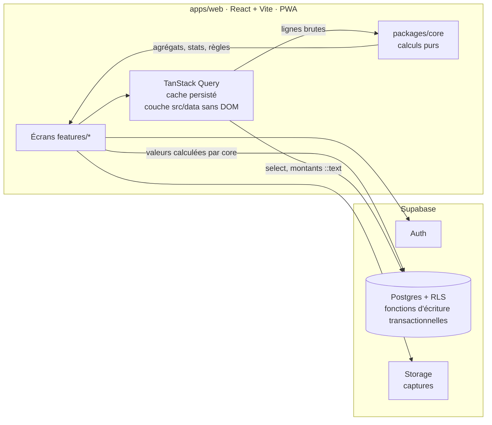
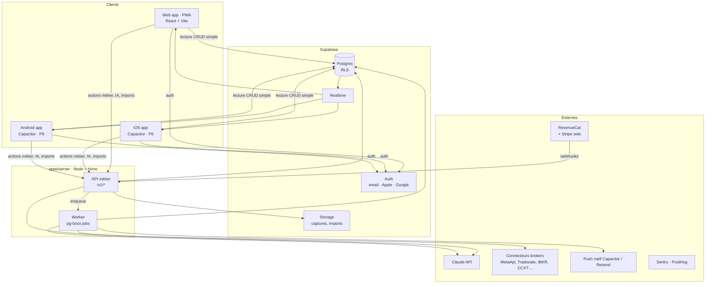

# Architecture — Edgebook (journal de trading multi-plateforme)

> Document vivant. Chaque choix marqué **[modifiable]** peut être changé via un ADR (`docs/DECISIONS.md`).
> Les éléments marqués **[invariant]** structurent tout le reste : les changer implique une migration réfléchie.
> Les éléments marqués **[post-MVP]** décrivent la cible complète et ne sont pas construits pendant le MVP (§0).

---

## 0. Périmètre MVP (ADR-015, ADR-016, ADR-017, ADR-023)

Le MVP est construit **d'abord en application web** responsive et installable (PWA, `apps/web`, ADR-023/024) ; iOS et Android viendront en P6 en emballant le même code avec Capacitor. `apps/app` (Expo) et `packages/ui` (primitives React Native) sont **gelés** : conservés, plus développés.
Le MVP est construit en premier (phases M0–M9 de `ROADMAP.md`). Tant qu'il n'est pas terminé, **cette section prévaut** sur les sections suivantes quand elles divergent ; les sections marquées **[post-MVP]** restent la cible.

### 0.1 Actif / reporté
| Actif dans le MVP (web responsive + PWA) | Reporté après le MVP |
|---|---|
| Auth Supabase, onboarding, comptes multiples saisis à la main (tous `account.kind`), dépôts/retraits | Import CSV (premier chantier post-MVP) |
| Saisie et édition **manuelles** des trades (exécutions → trades), tags, setups, notes, captures | Synchro API et connecteurs brokers (§5.3) |
| Dashboard, calendrier P&L + Psych | `apps/server` (Hono), worker pg-boss, `packages/api-client`, API §8 |
| Journal + psychologie (pré/post-session, humeur, émotions, captures) | `daily_stats` matérialisés (§5.4) |
| Analytics (equity, drawdown, par symbole/setup/tag/session/heure/jour, distribution des R) | Modèles de règles prop firm `rule_sets` (§5.7) |
| Règles perso + checklists de confluences, alertes in-app | Coach IA et score (§5.8), abonnements (§5.9), notifications push/e-mail (§5.10) |
| FR/EN, sombre/clair, couleurs P&L, masquage des montants | Export RGPD, apps iOS/Android (Capacitor) et stores, Sentry/PostHog (§11, §12) |
| Données de démo (seed) | Suppression de compte in-app (ADR-018 : option B pendant le MVP) |

### 0.2 Vue d'ensemble MVP

Structure du monorepo pendant le MVP : celle du §4 **sans** `apps/server` ni `packages/api-client`, **avec** `packages/db` (types générés, §4) ; routes `coach` et réglages connexions/abonnement absents ; `apps/app` et `packages/ui` gelés (ADR-023).

### 0.3 Règles d'accès aux données (MVP)
- L'app n'utilise que la clé anon + la session utilisateur ; la RLS est l'unique barrière (tests RLS sur chaque table et sur Storage).
- **Toute valeur dérivée** (jour de trading, regroupement, P&L, R, soldes, agrégats, évaluation des règles) est calculée par `packages/core` ; aucun calcul métier en SQL ni dans un composant.
- Écritures multi-tables (trade + exécutions + tags + checklist) : fonction Postgres transactionnelle `security invoker` qui insère des valeurs déjà calculées (ADR-016, modalité à confirmer).
- Montants lus en chaîne (`net_pnl::text`…) puis convertis en `Decimal` : PostgREST sérialise `numeric` en nombre JSON.
- Clés de requête : `[domaine, accountId | 'all', période/mois, filtres]` ; mutations optimistes avec invalidation ciblée des clés calendrier/dashboard/analytics.
- Changement de fuseau ou d'heure de bascule d'un compte : recalcul et réécriture de `trades.trading_day` par l'app.
- « Tous les comptes » multi-devises : un total par devise, sans conversion (ADR-019).

### 0.4 Écarts avec les sections suivantes pendant le MVP
| Section | Pendant le MVP |
|---|---|
| §2 répartition | Seule la ligne « Client → Supabase direct » s'applique, étendue aux écritures métier ; `packages/core` s'exécute dans l'app |
| §5.4, §5.5, §10 | Agrégats calculés à la volée sur les trades de la période ; objectif < 1,5 s tenu sans `daily_stats` |
| §5.7 | Règles perso et checklists uniquement ; `rule_violations` non stockées (évaluation à la volée) ; alertes in-app |
| §5.11 | Auth et onboarding actifs ; suppression selon ADR-018 ; export reporté |
| §9 | Pas de `service_role`, pas de rate limiting applicatif (limites Supabase) ; pas d'identifiants broker |
| §11 | Environnements dev (Supabase cloud, ADR-020) + préproduction web statique (Cloudflare Pages, ADR-025) ; pas de serveur, pas de build natif |

---

## 1. Objectifs et périmètre

### 1.1 Ce que fait l'app
| Domaine | Fonction |
|---|---|
| Comptes | Plusieurs comptes par utilisateur, de tout type (perso, démo, prop firm, backtest), toute devise |
| Trades | Import CSV, synchro API, saisie manuelle ; exécutions regroupées en positions |
| Dashboard | Solde, P&L, rendement, courbe d'equity, score, accès rapides, filtre compte + période |
| Calendrier | Vue mensuelle P&L / psychologie, totaux hebdo, stats du mois |
| Journal | Entrée quotidienne (notes, humeur, émotions, captures), notes par trade |
| Trade log | Liste filtrable, détail d'un trade, tags, setups, confluences |
| Analytics | Equity, drawdown, par symbole / setup / session / heure / jour, distribution des R |
| Règles | Règles perso + **modèles de règles prop firm** (optionnels) avec suivi en temps réel |
| Coach IA | Conseils, chat avec outils, score de performance sur 5 piliers |
| Abonnement | Free / Pro (le découpage est libre), achat sur web et dans les stores |

### 1.2 Généralisation au-delà des prop firms **[invariant]**
- `account.kind` : `personal` · `demo` · `prop_challenge` · `prop_funded` · `backtest` · `paper`.
- `instrument.asset_class` : `forex` · `futures` · `stock` · `option` · `crypto` · `cfd` · `index` · `other`.
- Les règles prop firm sont **un module optionnel** (`RuleSet`) attaché à un compte, pas un concept central.
- Multi-devise : chaque compte a sa devise ; les agrégats multi-comptes sont convertis dans la devise d'affichage de l'utilisateur (taux journaliers stockés).
- Le « jour de trading » est configurable par compte (fuseau + heure de bascule, ex. 17:00 New York pour le forex/futures, minuit local pour les actions).

### 1.3 Hors périmètre V1 **[modifiable]**
Exécution d'ordres, signaux de trading, social/copy trading, backtesting intégré.

---

## 2. Vue d'ensemble (cible complète — vue MVP au §0.2)



### Principe de répartition des responsabilités **[invariant]**
| Qui | Fait quoi |
|---|---|
| **Client → Supabase direct** | Lectures et écritures simples protégées par RLS (journal, tags, préférences, règles). |
| **Client → API** (post-MVP) | Tout ce qui demande un secret, un calcul lourd, une validation métier ou un tiers : imports, synchro, IA, paiements, suppression de compte, export. |
| **Worker** (post-MVP) | Tâches longues/planifiées : synchro broker, recalcul des stats, génération des conseils IA, notifications. |
| **packages/core** | Toute la logique de calcul, exécutée côté serveur (source de vérité) et réutilisable côté client (affichage instantané, mode hors-ligne). |

---

## 3. Stack **[modifiable, sauf mention]**

| Couche | Choix par défaut | Pourquoi | Alternatives acceptables |
|---|---|---|---|
| Monorepo | pnpm + Turborepo | Partage de code app/serveur | Nx |
| App | **React + Vite + TypeScript**, SPA responsive installable (PWA, `vite-plugin-pwa`), routeur **TanStack Router** ; iOS/Android en P6 via **Capacitor** (ADR-023/024) | Boucle de dev rapide, écosystème web, un seul code web + stores | Expo (gelé, `apps/app`), Next.js |
| Styles | **Tailwind CSS v4**, thème généré depuis `packages/ui/src/tokens.data.cjs` | Tokens à source unique | — |
| Composants | **shadcn/ui** (Radix) copiés dans `apps/web/src/components/ui` | Accessibles, contrôle total du design | — |
| Icônes | lucide-react | Même set que l'app de référence | — |
| Graphiques | Composant `Chart` (chart shadcn sur **recharts**), heatmap en grille CSS (ADR-024) | Types repris de `packages/ui/src/chart/types.ts` | ECharts |
| Données client | TanStack Query (+ persistance) | Cache, offline, invalidation | — |
| État UI | Zustand | Léger | Jotai |
| Formulaires | react-hook-form + zod | Schémas zod partagés avec l'API | — |
| i18n | i18next + react-i18next, locale initiale `navigator.languages` → `resolveLocale` (`@repo/i18n`) | FR/EN dès J1 | Lingui |
| Backend données/auth | **Supabase** (Postgres, Auth, Storage, Realtime) | Postgres + RLS + auth sociale clé en main | Neon + Better Auth |
| API métier **[post-MVP]** | **Hono** sur Node (TypeScript) | Léger, typé, portable (Node, Bun, edge) | Fastify, Supabase Edge Functions |
| Contrat API **[post-MVP]** | zod + `@hono/zod-openapi` → client typé généré | Typage de bout en bout | tRPC |
| Jobs **[post-MVP]** | **pg-boss** (queue dans Postgres) | Zéro infra en plus | BullMQ + Redis, Inngest |
| ORM / SQL | Drizzle (côté serveur, **[post-MVP]**) ; migrations SQL via Supabase CLI ; MVP : `supabase-js` + types générés | Types + SQL lisible | Kysely, Prisma |
| Animations et interactions | Transitions CSS / `tw-animate-css` (+ `motion` si besoin), `@tanstack/react-virtual`, interface `Haptics` (vide sur le web, Capacitor en P6) — ADR-017/024 | Animations sur le compositeur, 60 fps | — |
| IA **[post-MVP]** | Claude API (tool use + streaming) | Qualité d'analyse | Autre LLM derrière la même interface `CoachProvider` |
| Paiements **[post-MVP]** | **RevenueCat** (IAP iOS/Android + Stripe pour le web) | Obligatoire en pratique pour les stores, entitlements unifiés | Stripe seul (web uniquement) |
| Notifications **[post-MVP]** | Push via Capacitor (P6) + Resend (email) | — | OneSignal |
| Observabilité **[post-MVP]** | Sentry (app + serveur), PostHog (produit, feature flags) | — | — |
| Hébergement | Web : **Cloudflare Pages** (ADR-025) · Server **[post-MVP]** : Fly.io ou Railway · DB : Supabase Cloud (région UE) | Simple, RGPD | Render, AWS |
| Builds mobiles **[P6]** | Capacitor (projets iOS/Android générés depuis `apps/web`) ; EAS gelé avec `apps/app` | — | Fastlane |
| Tests | Vitest · Playwright (`apps/web`) · tests natifs Capacitor en P6 | — | — |
| CI | GitHub Actions | — | — |

Choix structurants retenus en M0 (versions exactes : `package.json` / lockfile, jamais figées ici) :
- **TypeScript 6, pas 7** : typescript-eslint (et le SDK Expo d'`apps/app`, gelé) ne supportent pas encore TS 7.
- **ESLint 9** (flat config), pas 10 : requis par les plugins Expo d'`apps/app` ; à réévaluer si `apps/app` quitte le workspace.
- **React** : même version majeure.mineure dans `apps/web` et `apps/app` tant que les deux sont dans le workspace (`nodeLinker: hoisted`, ADR-024).
- Montants : configuration `Decimal` dans ADR-005. Jour de trading : `formatInTimeZone` (date-fns-tz) dans `packages/core/time`.
- Session : web = `localStorage` (§9) ; session native chiffrée d'`apps/app` gelée, stockage sécurisé Capacitor choisi en P6.

---

## 4. Structure du monorepo
> MVP : sans `apps/server`, `packages/api-client`, route `coach` ni réglages connexions/abonnement (§0.2) ; les données passent par `apps/web/src/data` (client Supabase + TanStack Query, **sans dépendance au DOM**, extractible en `packages/data`), typées par `packages/db`. `apps/app` et `packages/ui` sont gelés (ADR-023).

```
.
├── CLAUDE.md
├── docs/                         # ARCHITECTURE, DATA_MODEL, ROADMAP, DECISIONS, RELEASE
├── apps/
│   ├── web/                      # React + Vite + PWA (MVP ; Capacitor en P6) — ADR-023
│   │   ├── src/
│   │   │   ├── routes/           # TanStack Router (routes = fichiers)
│   │   │   │   ├── _auth/        # login, signup, forgot, onboarding
│   │   │   │   ├── _app/         # zone connectée : tabs (< 1024 px) / sidebar ; dashboard,
│   │   │   │   │                 # calendar, trades, journal, analytics, rules, settings
│   │   │   │   │                 # (coach post-MVP)
│   │   │   │   └── dev/          # catalogue, exclu du build de production
│   │   │   ├── features/         # UI par domaine (composants, hooks de vue)
│   │   │   ├── components/ui/    # composants shadcn thémés + Chart
│   │   │   ├── data/             # requêtes/mutations Supabase + clés TanStack Query, sans DOM
│   │   │   └── lib/              # supabase client, i18n, stockage, flags
│   │   └── vite.config.ts
│   ├── app/                      # Expo — GELÉ (ADR-023), conservé, plus développé
│   └── server/
│       ├── src/
│       │   ├── routes/v1/        # imports, sync, coach, billing, account, export
│       │   ├── jobs/             # sync-account, recompute-stats, coach-tips, notify
│       │   ├── connectors/       # un dossier par source (mt5, tradovate, ibkr, ccxt, csv/*)
│       │   ├── coach/            # prompts, outils, provider LLM
│       │   ├── db/               # drizzle schema (miroir des migrations)
│       │   └── index.ts          # api + worker (même image, rôle via env)
│       └── Dockerfile
├── packages/
│   ├── core/                     # logique pure : métriques, score, temps, regroupement, règles
│   ├── schemas/                  # schémas zod partagés (DTO, formulaires)
│   ├── api-client/               # client typé généré depuis l'OpenAPI (post-MVP)
│   ├── db/                       # types générés Supabase (`db:types`), propriétaire `database`
│   ├── ui/                       # GELÉ : primitives React Native ; tokens.data.cjs = source des tokens
│   ├── i18n/                     # fichiers de traduction fr/en
│   └── config/                   # tsconfig, eslint, APP_NAME, feature flags par défaut
└── supabase/
    ├── migrations/
    ├── seed.sql                  # données de démo (dont le jeu « mars 2026 »)
    └── config.toml
```

Règle d'import **[invariant]** : `apps/*` → `packages/*` uniquement. `packages/core` n'importe rien d'autre que `decimal.js`, `date-fns`/`date-fns-tz` et `packages/schemas`.

---

## 5. Domaines et modules

Chaque domaine = un dossier dans `packages/core/<domaine>`, `apps/server/src/routes/v1/<domaine>` (post-MVP) et `apps/web/src/features/<domaine>`.

### 5.1 Comptes (`accounts`)
- Création manuelle ou via connexion.
- Champs clés : type, devise, solde initial, fuseau, heure de bascule du jour, broker/plateforme, `rule_set_id` optionnel.
- Soldes : calculés depuis `starting_balance + Σ pnl net + dépôts − retraits` (table `cash_movements`), et, si synchro, comparés au solde broker (écart affiché).

### 5.2 Trades (`trading`)
- **Modèle en deux niveaux [invariant]** : `executions` (fills bruts) → `trades` (position aller-retour).
  Nécessaire pour les actions/options/futures (entrées/sorties partielles) ; le forex MT5 donne souvent déjà des positions → 1 trade = 2 exécutions.
- Regroupement FIFO par défaut, paramétrable par compte (FIFO / moyenne pondérée).
- P&L net = brut − commissions − frais − swap. Le multiplicateur de contrat vient de `instruments`.
- R multiple = P&L net / risque initial (si stop connu ou risque saisi).
- Déduplication à l'import via `external_id` + hash (compte, symbole, heure, qty, prix).

### 5.3 Imports et connecteurs (`connectors`) **[post-MVP]**
> MVP : saisie manuelle uniquement (§0.1). L'import CSV est le premier chantier après le MVP (ROADMAP P1).
Interface commune **[invariant]** :
```ts
interface Connector {
  id: string;                       // 'mt5-metaapi', 'csv-mt5', 'tradovate', 'ibkr-flex', 'ccxt-binance'…
  kind: 'csv' | 'api';
  capabilities: { balances: boolean; openPositions: boolean; history: boolean; realtime: boolean };
  validateCredentials?(input): Promise<Result>;
  parseFile?(file): AsyncIterable<RawExecution>;          // csv
  fetchHistory?(creds, since): AsyncIterable<RawExecution>; // api
  fetchBalance?(creds): Promise<Money>;
}
```
- Priorité V1 **[modifiable]** : CSV générique (mapping de colonnes guidé) + CSV MT4/MT5 + saisie manuelle.
- V2 : MetaApi (MT4/MT5, identifiants « investor » en lecture seule), Tradovate, IBKR Flex Query, CCXT (clés API lecture seule), NinjaTrader CSV, cTrader.
- Identifiants chiffrés (Supabase Vault ou chiffrement applicatif AES-GCM, clé en variable d'env serveur). Jamais renvoyés au client.
- Synchro : job planifié par compte (fréquence selon le plan) + bouton « Rafraîchir ». Statut exposé : `last_synced_at`, `sync_status`, `sync_error`.

### 5.4 Statistiques (`stats`)
- Fonctions pures dans `packages/core/stats` : win rate, profit factor, espérance, gain/perte moyens, ratio moyen, max drawdown (montant et %), séries, P&L par jour/semaine/mois, par dimension (symbole, setup, session, heure, jour de semaine, tag).
- **Matérialisation [post-MVP, ADR-006 ; MVP : calcul à la volée côté app, ADR-016]** : table `daily_stats` (compte × jour de trading) recalculée par le worker après chaque import/modification → le calendrier et le dashboard lisent ces agrégats (rapide sur mobile).
- Les vues détaillées (analytics) calculent à la volée côté serveur sur les trades filtrés, avec cache.
- Tests « golden » **[invariant]** : jeux de trades de référence dont les résultats attendus sont figés (inclure le cas de la vidéo : solde initial 200 000, P&L −19 743,43 → rendement −9,87 %, win rate 16 %, ratio moyen 2,92 → profit factor 0,56).

### 5.5 Calendrier (`calendar`)
- Lit `daily_stats` (MVP : agrégats `packages/core` sur les trades du mois) + présence d'entrée de journal + humeur.
- Modes : P&L ($ / % / R) et Psych (humeur).
- Premier jour de semaine selon la locale (modifiable dans les préférences). Colonne total hebdo.
- Changement de mois : les stats du mois précédent **ne doivent jamais rester affichées** (clé de requête par mois + squelette).

### 5.6 Journal (`journal`)
- `journal_entries` : une par (utilisateur, jour), optionnellement liée à un compte.
- Pré-session (humeur, sommeil, plan, biais) / post-session (humeur, respect du plan, leçons), émotions en tags, pièces jointes (Storage).
- Notes et captures par trade (`trade_notes`, `attachments`).
- Brouillon hors-ligne sur mobile.

### 5.7 Règles et checklists (`rules`)
> MVP : règles perso, checklists et évaluateur actifs ; `rule_sets`, `rule_violations` stockées et alertes push **[post-MVP]**.
- `rules` perso typées : `max_trades_per_day`, `max_positions_per_day`, `max_daily_loss`, `max_total_loss` (perte max statique par rapport au solde initial — ajout proposé pour le MVP, à confirmer), `max_risk_per_trade`, `allowed_sessions`, `allowed_symbols`, `required_checklist`, `custom` (texte libre, suivi manuel).
- `rule_sets` **[post-MVP]** : modèles prop firm (objectif de profit, perte journalière max, perte max statique/suiveuse, jours minimum, consistency rule). Stockés en **données** (JSON versionné), pas en code → ajouter une firme = ajouter une ligne.
- Évaluateur pur `packages/core/rules/evaluate(rules, trades, balances)` → violations + marges restantes (« il te reste 257 $ avant la perte max »).
- Checklists de confluences (pré-trade) : les éléments cochés sont attachés au trade → pilier Discipline + analyse « win rate par confluence ».

### 5.8 Coach IA (`coach`) **[post-MVP]**
Pipeline **[invariant]** : `métriques calculées` → `règles d'insight déterministes` → `LLM (formulation + conversation)`.
- **Conseils** : le worker calcule des insights candidats (ex. « win rate < 30 % et ratio > 2 », « pertes concentrées le lundi », « overtrading après une perte ») avec leurs chiffres, puis le LLM les formule selon les préférences (style, langue). Stockés dans `coach_tips` (cache 24 h). Un conseil ne peut pas contredire ses chiffres.
- **Chat** : streaming via l'API. Le LLM dispose d'outils serveur en lecture seule, limités à l'utilisateur :
  `get_metrics(filters)`, `query_trades(filters, limit)`, `get_calendar(month)`, `get_rules_status()`, `get_score()`, `get_journal(range)`.
- **Actions rapides** = prompts prédéfinis + outils (analyser la performance, confluences, patterns, score, derniers trades, meilleurs horaires) ; la réponse peut contenir des blocs de graphique structurés (`{type:'chart', spec}`) rendus par `Chart`.
- **Score** (0–100) : 5 piliers (Rentabilité, Gestion du risque, Régularité, Discipline, Exécution), calcul **déterministe** dans `packages/core/score`. Poids et seuils dans une config versionnée (`score_config_version` stocké avec chaque snapshot). Paliers de libellé configurables. Minimum de trades requis avant d'afficher un score (sinon « Pas assez de données »).
- Garde-fous : pas de conseil d'investissement personnalisé ni de promesse de gain, disclaimer visible, quotas par plan, journalisation des coûts de tokens par utilisateur.
- Abstraction `CoachProvider` pour changer de modèle sans toucher au reste.

### 5.9 Abonnements (`billing`) **[post-MVP]**
- RevenueCat = source de vérité des droits (`entitlements`), avec webhooks vers `/v1/billing/webhook` → table `subscriptions`.
- Mobile : achats intégrés (obligatoire pour du contenu numérique dans les stores). Web : Stripe via RevenueCat.
- Contrôle d'accès par entitlement (`pro`) côté API **et** UI. Liste des fonctions payantes dans `packages/config/plans.ts` **[modifiable]**.

### 5.10 Notifications **[post-MVP]**
Synchro terminée/échouée, règle proche de la limite ou violée, rappel de journal, nouveau conseil. Préférences par canal (push/email).

### 5.11 Compte utilisateur et conformité
- Auth : email + mot de passe, magic link, Google, **Sign in with Apple** (requis sur iOS dès qu'un login social tiers est proposé — à vérifier au moment de la soumission).
- Suppression de compte in-app (exigence Apple) → job qui purge données, fichiers et identifiants broker. MVP : ADR-018 (en attente).
- Export de données (CSV/JSON) — RGPD **[post-MVP]**.
- Hébergement des données en UE par défaut.

---

## 6. Navigation et UI

### 6.1 Navigation **[modifiable]**
- **Mobile** : tab bar (Dashboard · Calendrier · Journal · Coach · Plus). « Plus » contient Trades, Analytics, Règles, Réglages.
  MVP (ADR-011, acceptée) : Dashboard · Calendrier · Trades · Journal · Plus (Analytics, Règles, Réglages) ; bouton d'ajout rapide de trade global.
- **Web ≥ 1024 px** : sidebar fixe avec toutes les sections ; en dessous, même tab bar que le mobile.
- Header : sélecteur de compte global (« Tous les comptes » inclus) + période, persistés dans Zustand + URL (web).
- Tab bar **flottante** (détachée des bords, coins arrondis, ombre) et **translucide** (`backdrop-filter` ; `expo-blur` dans `apps/app` gelé) ; le contenu défile sous la barre (marge basse réservée sur chaque écran).
- Web : « mobile » = largeur < 1024 px (navigateur ou PWA). Implémentation : TanStack Router (ADR-024).

### 6.2 Design system
- Tokens : source unique `packages/ui/src/tokens.data.cjs` (couleurs, rayons, espacements, typo, durées), exposée au thème Tailwind v4 d'`apps/web` via `@repo/ui/tokens-data` (et à NativeWind dans `apps/app`, gelé).
- Direction visuelle **acceptée** (ADR-012) : fond noir, cartes `#0E0E11`, accent bleu légèrement décalé de `#5D99F9` (ADR-012), police Inter (ADR-021), profits en bleu. Nom et logo restent provisoires (ADR-012). Aucun nom, logo, texte ni maquette de la référence n'est copié.
- Thème sombre par défaut, thème clair prévu dans les tokens.
- Option « couleurs P&L » : bleu/gris (défaut) ou vert/rouge.
- Composants de base (shadcn/ui thémés, `apps/web/src/components/ui`) : `Screen`, `Card`, `GlowCard`, `StatTile`, `Button`, `IconButton`, `Segmented`, `Select`, `DateRangePicker`, `Sheet`, `Skeleton`, `ShimmerBar`, `ProgressBar`, `ScoreRing` (post-MVP), `DayCell`, `EmptyState`, `Toast`, `VirtualizedList` (`@tanstack/react-virtual`), `Chart`.
- **Persistance des préférences d'affichage** (M1) : thème, couleurs P&L, masquage des montants et langue sont lus au démarrage depuis le stockage local (avant le premier rendu, avec repli sur les valeurs par défaut si la lecture échoue) et réécrits à chaque changement. Ils seront **synchronisés avec `preferences` en base** en M2 (§5.1, DATA_MODEL).
- Masquage des montants (icône œil) global, persistant.
- **Catalogue interne** de composants (route `/dev/catalog`) : activé par le mode développement de Vite, **exclu des builds de production**.
- Accessibilité : tailles dynamiques, contraste AA, libellés pour lecteurs d'écran, respect de « réduire les animations ».

### 6.3 Fluidité et finition **[priorité n° 1 du MVP]**
Exigences et protocole de mesure : ADR-017. En résumé, vérifiées à chaque clôture de phase :
| Exigence | Cible |
|---|---|
| Animations, transitions | CSS / `tw-animate-css` (+ `motion` si besoin), durées/courbes en tokens, `prefers-reduced-motion` |
| Chargement | squelettes, jamais de spinner plein écran sur les écrans principaux |
| Écritures | mises à jour optimistes avec retour arrière |
| Mobile | retours haptiques sur les interactions clés (interface `Haptics` : vide sur le web, Capacitor en P6) |
| Listes | `@tanstack/react-virtual` au-delà de 50 éléments |
| Interactions principales | 60 fps (export de production, CPU ×4 ; Capacitor Android en P6) ; `Segmented` mesuré hors changement de thème |
| Changement de thème | action ponctuelle hors seuil fps : sans rechargement, < 200 ms (ADR-017, amendement du 2026-09-25) |
| Dashboard | premier affichage < 1,5 s |
| Changement de mois/compte | aucune donnée périmée visible |

Mesure de fluidité : la mesure **web** automatisée (Playwright, CPU ×4, `vite preview`) **fait foi et est bloquante** ; la mesure native se fera sur Capacitor Android en P6 — ADR-017, révision du 2026-09-25.

---

## 7. Données
Voir `docs/DATA_MODEL.md`. Points structurants **[invariant]** :
- Clés UUID, `user_id` sur chaque table utilisateur, RLS `user_id = auth.uid()`.
- Montants en `numeric(20,8)` en base, `Decimal` en TS, sérialisés en chaîne dans l'API.
- Suppression logique uniquement pour les trades importés (`deleted_at`) afin d'éviter les réimports.

---

## 8. API (contrat) **[post-MVP]**
> MVP : pas d'API ; lectures et écritures via Supabase selon §0.3.

Base : `/v1`, JSON, auth par JWT Supabase (`Authorization: Bearer`). Erreurs au format `{ error: { code, message, details? } }`.

| Méthode | Route | Rôle |
|---|---|---|
| POST | `/imports` | Upload CSV (URL Storage) + connecteur + mapping → job |
| GET | `/imports/:id` | Statut, lignes importées/ignorées/erreurs |
| POST | `/connections` | Ajouter une connexion broker (identifiants chiffrés) |
| POST | `/accounts/:id/sync` | Lancer une synchro |
| GET | `/dashboard` | KPI + série d'equity + score (filtres compte, période) |
| GET | `/calendar` | Jours du mois + stats du mois |
| GET | `/analytics/:report` | Rapports par dimension |
| GET | `/rules/status` | Évaluation des règles + marges |
| GET | `/coach/tips` | Conseils en cache |
| GET | `/coach/score` | Score + piliers + historique |
| POST | `/coach/chat` | Message → réponse streamée (SSE) |
| GET/DELETE | `/coach/sessions[/:id]` | Historique des conversations |
| POST | `/billing/webhook` | RevenueCat |
| POST | `/account/export` | Export RGPD (job + lien) |
| DELETE | `/account` | Suppression du compte |

Le CRUD simple (journal, tags, règles, préférences, notes) passe par Supabase direct avec RLS.

---

## 9. Sécurité
- RLS sur toutes les tables ; tests automatisés qui vérifient qu'un utilisateur B ne lit rien de A ; garde-fou `rls_disabled_tables()` (DATA_MODEL §Système) vérifié par les tests RLS (`pnpm test:rls`, CI).
- Clé `service_role` uniquement sur le serveur.
- Rate limiting par utilisateur sur l'API (surtout `/coach/chat`, `/imports`).
- Validation zod de toutes les entrées ; taille max d'upload ; parsing CSV en streaming.
- Identifiants broker : lecture seule exigée quand la plateforme le permet, chiffrés, rotation de clé documentée.
- Stockage de session : web = `localStorage` (risque XSS assumé faute de serveur, ADR-016) → CSP stricte via `_headers` Cloudflare Pages (ROADMAP M9) ; le service worker de la PWA ne met jamais en cache les réponses Supabase. Natif (P6, Capacitor) : stockage sécurisé à choisir (l'implémentation SecureStore + AES-256-GCM d'`apps/app` est gelée).
- Anti-secrets : hook `.githooks/pre-commit` (`check:secrets --staged`) ; scan de tout l'historique en CI.
- Journal d'audit pour les actions sensibles (connexion broker, suppression, export).

---

## 10. Hors-ligne et performance
- TanStack Query persisté derrière une interface de stockage : dashboard et calendrier lisibles hors-ligne. MVP web : `localStorage` ou IndexedDB, clé propre à chaque utilisateur, sans changer l'interface.
- Journal : file d'écritures hors-ligne rejouée à la reconnexion.
- Listes longues : `@tanstack/react-virtual`, pagination par curseur.
- Objectif : premier affichage du dashboard < 1,5 s sur un mobile milieu de gamme, via les agrégats `daily_stats` (MVP : agrégats `packages/core` sur les trades de la période + cache persisté, §0.4).
- MVP : cache de lecture persisté et brouillons locaux du journal ; la file d'écritures hors-ligne est reportée (backlog).

---

## 11. Environnements, CI/CD, publication
> MVP : colonne Server sans objet ; environnements local et preview uniquement, pas d'app native ni de soumission aux stores (§0.4). Dépôt GitHub privé + GitHub Actions.
| Env | DB | App | Server |
|---|---|---|---|
| local | Poste dev : projet Supabase cloud « dev » (UE, ADR-020) · CI : Supabase CLI (Docker du runner) | `pnpm dev:web` (Vite) ; téléphone : navigateur ou PWA via la préproduction | `tsx watch` |
| preview | Supabase « dev » pendant le MVP, projet « staging » ensuite | Cloudflare Pages, URL fixe (ADR-025) ; builds Capacitor internes en P6 | Fly app staging |
| production | Supabase prod (UE) | Web prod (Cloudflare Pages) + App Store / Play Store via Capacitor (P6) | Fly app prod |

- CI (chaque PR) : lint, typecheck, tests unitaires, tests RLS, build web (`apps/web`), Playwright. `apps/app` (gelé) est exclu des commandes par défaut et de la CI.
- Merge sur `main` → déploiement staging automatique ; tag `v*` → production.
- Mobile (P6) : Capacitor ; la chaîne EAS (`apps/app/eas.json`) est gelée. Procédure détaillée : `docs/RELEASE.md`.
- Migrations DB appliquées par la CI avant le déploiement du serveur.

Checklist stores (à revalider à la soumission, les règles évoluent) : compte Apple Developer et Google Play Console, politique de confidentialité et CGU hébergées, suppression de compte in-app, Sign in with Apple, privacy manifest iOS, fiche Data safety Android, disclaimer « pas un conseil financier », compte de démo pour la review, captures d'écran.

---

## 12. Observabilité et produit **[post-MVP]**
- Sentry : erreurs app + serveur, releases liées aux builds web et Capacitor.
- PostHog : événements clés (`import_completed`, `journal_saved`, `coach_message_sent`, `paywall_viewed`, `subscription_started`), feature flags pour les déploiements progressifs.
- Logs structurés (pino) côté serveur, sans données sensibles.

---

## 13. Points de liberté (à trancher plus tard sans casser l'architecture)
| Sujet | Où ça se change |
|---|---|
| Nom, logo, couleurs | `packages/config`, `packages/ui/tokens.ts` |
| Offre Free/Pro, prix | `packages/config/plans.ts` + RevenueCat |
| Poids du score, paliers | config `score_config` (versionnée) |
| Modèle IA | implémentation de `CoachProvider` |
| Nouveaux brokers | nouveau dossier dans `connectors/` |
| Nouvelles prop firms | ligne dans `rule_sets` (données) |
| Navigation | layout de `apps/web/src/routes/_app` |
| Retour à une app Expo native | dégeler `apps/app` + extraire `apps/web/src/data` en `packages/data` (ADR-023, réversibilité) |
| Hébergeur | Dockerfile + variables d'env, rien de spécifique à Fly |

---

## 14. Organisation du développement
Le code est produit par une équipe de sous-agents Claude Code (ADR-014). Leurs zones de responsabilité reprennent les dossiers du §4 ; le tableau de délégation est dans `CLAUDE.md`, les définitions dans `.claude/agents/`, l'affectation par phase dans `ROADMAP.md`.
