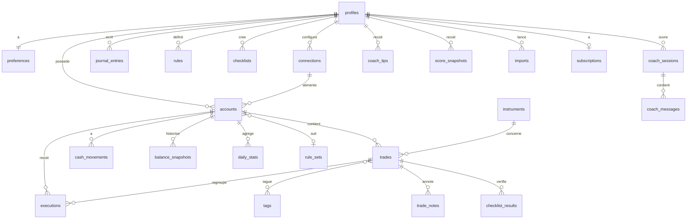

# Modèle de données

> Source de vérité = migrations SQL dans `supabase/migrations/`. Ce document décrit l'intention.
> Ajouter des colonnes est libre. Renommer ou supprimer une colonne nécessite une migration et une note dans `DECISIONS.md`.

## Conventions **[invariant]**
- `id uuid primary key default gen_random_uuid()`
- `user_id uuid not null references auth.users on delete cascade` sur toute table utilisateur
- `created_at`, `updated_at timestamptz not null default now()` (trigger pour `updated_at`)
- Montants : `numeric(20,8)` · quantités : `numeric(24,8)` · devises : `char(3)` (ISO 4217, `USDT` toléré via `text` si besoin)
- Horodatages en UTC (`timestamptz`) ; `trading_day date` calculé par `packages/core` avec le fuseau du compte (côté serveur après le MVP ; dans l'app pendant le MVP, ADR-016)
- RLS : `using (user_id = auth.uid())` en lecture et en écriture, sauf tables de référence (lecture publique)
- Énumérations : types Postgres `enum` ou `text` + `check` (préférer `text` + `check` pour évoluer facilement)

## Périmètre MVP (ADR-015, ADR-016)
Seules les tables du MVP sont créées pendant les phases M0–M9 ; les autres le seront avec leur phase post-MVP. Les colonnes qui référencent une table post-MVP (`accounts.connection_id`, `accounts.rule_set_id`, `accounts.rule_set_params`, `executions.import_id`) sont ajoutées avec cette table.

| Statut | Tables | Phase |
|---|---|---|
| MVP | `app_meta` (référence système) | M0 |
| MVP | `profiles`, `preferences` (sans `coach_tone` ni `notifications`), `accounts`, `cash_movements` | M2 |
| MVP | `instruments`, `executions`, `trades`, `tags`, `trade_tags`, `trade_notes`, `attachments` (+ bucket Storage) | M4 |
| MVP | `journal_entries` | M6 |
| MVP | `rules`, `checklists`, `checklist_results` | M8 |
| Post-MVP | `daily_stats` (**non matérialisé** pendant le MVP : agrégats calculés dans l'app), `imports` | P1 |
| Post-MVP | `coach_tips`, `score_snapshots`, `coach_sessions`, `coach_messages` | P2 |
| Post-MVP | `rule_sets`, `rule_violations` (MVP : évaluation à la volée, rien de stocké) | P3 |
| Post-MVP | `connections`, `balance_snapshots` | P4 |
| Post-MVP | `subscriptions` | P5 |
| Post-MVP | `jobs`, `audit_log`, `notifications`, `push_tokens` | P1–P6 selon besoin |
| À décider | `fx_rates` : selon ADR-019 (non créée si l'option A est retenue) | M2 |

Particularités MVP :
- Toutes les colonnes dérivées (`trading_day`, `gross_pnl`, `net_pnl`, `r_multiple`, `avg_entry`, `avg_exit`, `session`…) sont calculées par `packages/core` dans l'app, puis écrites via une fonction Postgres transactionnelle sans calcul (ADR-016).
- `trades.source` vaut toujours `manual` ; `executions.dedupe_hash` est nullable pour la saisie manuelle (unicité seulement si renseigné).
- Suppression d'un trade manuel : suppression physique (la suppression logique `deleted_at` ne sert qu'aux trades importés).

## Schéma

### Utilisateur
| Table | Colonnes principales |
|---|---|
| `profiles` | `id (= auth.users.id)`, `first_name`, `display_currency`, `locale`, `timezone`, `onboarding_completed_at`, `deleted_at` |
| `preferences` | `user_id`, `trading_style` (`scalper`/`day`/`swing`/`position`), `markets text[]`, `sessions text[]`, `week_starts_on smallint`, `pnl_display` (`currency`/`percent`/`r`), `pnl_colors` (`blue_gray`/`green_red`), `hide_amounts bool`, `coach_tone`, `notifications jsonb` |
| `subscriptions` | `user_id`, `entitlement`, `status`, `store`, `period_end`, `raw jsonb` |

### Comptes et connexions
| Table | Colonnes principales |
|---|---|
| `connections` | `user_id`, `connector_id`, `label`, `credentials_encrypted bytea`, `status`, `last_error`, `last_synced_at` |
| `accounts` | `user_id`, `connection_id?`, `name`, `kind`, `broker`, `platform`, `external_account_id`, `currency`, `starting_balance`, `starting_date`, `timezone`, `day_rollover_time time`, `grouping_method` (`fifo`/`average`), `rule_set_id?`, `rule_set_params jsonb`, `is_archived` |
| `cash_movements` | `account_id`, `type` (`deposit`/`withdrawal`/`payout`/`fee`/`adjustment`), `amount`, `occurred_at`, `note` |
| `balance_snapshots` | `account_id`, `taken_at`, `balance`, `equity`, `source` (`broker`/`computed`) |

### Marché
| Table | Colonnes principales |
|---|---|
| `instruments` | `symbol` (normalisé), `asset_class`, `base_ccy`, `quote_ccy`, `contract_multiplier`, `tick_size`, `tick_value`, `aliases text[]` (ex. `GBPUSD.sim`, `GBPUSDm`) — lecture publique ; les instruments inconnus sont créés à l'import avec `user_id` |
| `fx_rates` | `date`, `base`, `quote`, `rate` — lecture publique |

### Trading
| Table | Colonnes principales |
|---|---|
| `executions` | `account_id`, `trade_id?`, `instrument_id`, `external_id`, `side` (`buy`/`sell`), `quantity`, `price`, `commission`, `fees`, `executed_at`, `import_id?`, `dedupe_hash unique` |
| `trades` | `account_id`, `instrument_id`, `direction` (`long`/`short`), `status` (`open`/`closed`), `opened_at`, `closed_at`, `trading_day`, `quantity`, `avg_entry`, `avg_exit`, `stop_loss?`, `take_profit?`, `initial_risk?`, `gross_pnl`, `commission`, `fees`, `swap`, `net_pnl`, `r_multiple?`, `mae?`, `mfe?`, `session` (`asia`/`london`/`new_york`/`overlap`/`other`), `setup?`, `rating smallint?`, `source` (`manual`/`import`/`sync`), `deleted_at?` |
| `tags` | `user_id`, `name`, `kind` (`setup`/`confluence`/`mistake`/`emotion`/`custom`), `color` |
| `trade_tags` | `trade_id`, `tag_id` |
| `trade_notes` | `trade_id`, `body`, `created_at` |
| `attachments` | `user_id`, `owner_type` (`trade`/`journal`), `owner_id`, `storage_path`, `mime` |
| `imports` | `user_id`, `account_id`, `connector_id`, `storage_path?`, `mapping jsonb`, `status`, `rows_total`, `rows_imported`, `rows_skipped`, `errors jsonb` |

### Agrégats (écrits par le worker uniquement) — post-MVP
| Table | Colonnes principales |
|---|---|
| `daily_stats` | `account_id`, `trading_day`, `trades_count`, `wins`, `losses`, `gross_pnl`, `net_pnl`, `fees`, `r_total`, `volume`, `best_trade`, `worst_trade`, `end_balance` — clé unique (`account_id`, `trading_day`) |

### Journal, règles, checklists
| Table | Colonnes principales |
|---|---|
| `journal_entries` | `user_id`, `account_id?`, `day`, `pre_mood smallint`, `pre_sleep smallint`, `plan text`, `bias`, `post_mood smallint`, `followed_plan bool`, `notes text`, `lessons text`, `emotions text[]` — unique (`user_id`, `account_id`, `day`) |
| `rule_sets` | `slug` (`ftmo-2step`, `topstep-50k`…), `firm`, `name`, `version`, `definition jsonb` — lecture publique |
| `rules` | `user_id`, `account_id?`, `type`, `params jsonb`, `label`, `is_active` |
| `rule_violations` | `user_id`, `rule_id?`, `account_id`, `trade_id?`, `trading_day`, `detail jsonb` |
| `checklists` | `user_id`, `name`, `items jsonb` (`[{id,label,tag_id?}]`), `is_default` |
| `checklist_results` | `trade_id`, `checklist_id`, `checked_item_ids text[]` |

### Coach IA — post-MVP
| Table | Colonnes principales |
|---|---|
| `coach_tips` | `user_id`, `scope` (`all`/account id), `insight_key`, `title`, `body`, `icon`, `data jsonb`, `generated_at`, `expires_at`, `locale` |
| `score_snapshots` | `user_id`, `scope`, `computed_at`, `config_version`, `overall`, `profitability`, `risk_management`, `consistency`, `discipline`, `execution`, `details jsonb`, `trades_count` |
| `coach_sessions` | `user_id`, `title`, `created_at`, `archived_at?` |
| `coach_messages` | `session_id`, `role` (`user`/`assistant`/`tool`), `content jsonb`, `tokens_in`, `tokens_out`, `created_at` |

### Système
| Table | Colonnes principales |
|---|---|
| `app_meta` (MVP, M0) | `key text primary key`, `value text` — lecture publique (anon + authenticated), aucune écriture via l'API (seed/migrations uniquement) |

Fonctions système (migration M0) :
- `public.rls_disabled_tables()` : liste les tables de `public` sans RLS (`security definer`, `search_path` vide, exécutable par `anon`/`authenticated`). Garde-fou des tests RLS : doit renvoyer un ensemble vide.
- `public.set_updated_at()` : trigger `updated_at` (convention ci-dessus), non appelable via l'API.

Post-MVP : `jobs` (pg-boss, schéma dédié), `audit_log` (`user_id`, `action`, `meta`, `at`), `notifications` (`user_id`, `type`, `payload`, `read_at`), `push_tokens` (`user_id`, `token`, `platform`).

## Données de démo (seed)
- Utilisateur démo + 2 comptes : `Prop Challenge 200k` (USD, `prop_challenge` ; rule set type FTMO ajouté en P3 — pendant le MVP, règle perso de perte max 10 % en M8) et `Compte perso actions` (EUR).
- Jeu de mars 2026 identique à la vidéo de référence (10 jours, 24 trades, P&L du mois −17 527,71, 3 jours gagnants / 7 perdants) + 1 trade le 1er avril (−2 215,72).
- Entrées de journal les 12 et 13 septembre 2026 sans trade.
